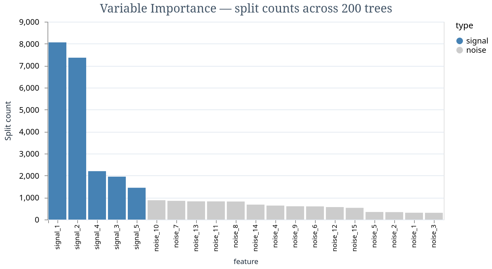

# StochTree-Ex

### Translator's Foreword

This library owes its existence to the work of others. The statistical method
is due to Chipman, George, and McCulloch, who in 2010 demonstrated that a sum
of deliberately stunted trees could outperform a single ambitious one — a
result that says something about committees as well as regression. The
computational machinery descends from [StochTree](https://stochtree.ai/) by
Jared Murray, P. Richard Hahn, and their collaborators at UT Austin, whose C++
and Python implementation set the standard for what a BART library should do
and how fast it should do it. He and Hahn's XBART algorithm, which replaces
the cautious Metropolis-Hastings tree surgery of classical BART with a greedy
grow-from-root strategy, is what makes the method practical at scale.

What follows is a translation, not an original composition. The ideas are
theirs. The Rust and the Elixir are ours — the conceit being that a language
designed for telephone switches might have something to offer a method designed
for regression trees. Whether this conceit is justified is left to the
benchmarks, which the reader will find below.

We are grateful to the StochTree team for making their work open source, and
to the broader BART community — Hill, Linero, Pratola, Sparapani — whose
extensions over the past decade have turned a clever idea into an indispensable
tool. Any errors in this translation are, naturally, the translator's own.

---

**Bayesian Additive Regression Trees (BART) for Elixir.**

Nonparametric Bayesian regression and causal inference via tree ensembles.
Pure Rust NIF — no C++ dependencies, no Python, no external services.


*5 signal features (blue) separated from 15 noise features (grey). 200 trees, 2000 observations, Rust NIF.*

```elixir
# Fit: 200 trees, data-adaptive priors, posterior samples in seconds
{forest, sigmas} = StochTree.BART.fit(x_train, y_train,
  num_trees: 200, num_gfr: 10, num_mcmc: 100)

# Predict with full uncertainty quantification
%{mean: mean, lower: q05, upper: q95} = StochTree.predict(forest, x_test)

# Which features matter?
importance = StochTree.variable_importance(forest)
#=> [{3, 4521}, {0, 3892}, {1, 2104}, ...]
```

## What is BART?

BART models the relationship `y = f(X) + noise` where `f` is unknown. Instead
of specifying a functional form (linear, polynomial, neural network), BART
represents `f` as a sum of many small decision trees, each contributing a
small amount to the prediction. The trees discover nonlinearities, interactions,
and threshold effects automatically.

The Bayesian part: every tree structure and every leaf value has a posterior
distribution. Predictions come with honest uncertainty bands. The model
regularizes itself through priors on tree depth and leaf values — no
cross-validation needed.

**BART is not gradient-based.** It uses Metropolis-Hastings on tree topology,
not HMC/NUTS on continuous parameters. The sampling is entirely different from
libraries like PyMC, Stan, or eXMC.

## When to Use BART

| Use BART when... | Use NUTS/HMC when... |
|---|---|
| Functional form is unknown | You know the model structure |
| Many features (10-1000) | Few parameters (1-20) |
| Goal is prediction + uncertainty | Goal is parameter inference |
| Minimal domain knowledge | Rich domain knowledge to encode |
| Feature discovery / variable selection | Precise posteriors on specific parameters |
| Causal inference (treatment effects) | Time series / state-space models |

## Installation

Requires a Rust compiler (1.70+). Install via [rustup](https://rustup.rs/).

```elixir
def deps do
  [
    {:stochtree_ex, "~> 0.1.0"}
  ]
end
```

The Rust NIF compiles automatically on `mix compile` (~15 seconds first build).

## Quick Start

### Regression

```elixir
# Generate synthetic data: y = sin(x) + noise
x_train = for _ <- 1..500, do: [:rand.uniform() * 6.28]
y_train = Enum.map(x_train, fn [xi] -> :math.sin(xi) + :rand.normal() * 0.2 end)

# Fit BART
{forest, sigma_samples} = StochTree.BART.fit(x_train, y_train,
  num_trees: 200,     # number of trees in ensemble
  num_gfr: 10,        # grow-from-root warm-start iterations
  num_mcmc: 100,       # MCMC sampling iterations
  seed: 42
)

# Predict at new points
x_test = for x <- 0..62, do: [x / 10.0]
preds = StochTree.predict(forest, x_test)

# preds.mean    — posterior mean prediction per point
# preds.lower   — 5th percentile (lower credible bound)
# preds.upper   — 95th percentile (upper credible bound)
# preds.samples — raw posterior samples [n_mcmc][n_test]
```

### Feature Importance

```elixir
# Which features drive the predictions?
importance = StochTree.variable_importance(forest)
#=> [{0, 8234}, {3, 6721}, {1, 4102}, {2, 890}, {4, 45}]
# Feature 0 was split on 8,234 times across all trees and samples.
# Features with more splits are more important.
```

### Data Formats

```elixir
# List of lists (row-major)
x = [[1.0, 2.0, 3.0], [4.0, 5.0, 6.0]]

# Nx tensors (optional dependency)
x = Nx.tensor([[1.0, 2.0, 3.0], [4.0, 5.0, 6.0]])

# Response: list of floats
y = [1.5, 3.7]
```

## Options

| Option | Default | Description |
|---|---|---|
| `num_trees` | 200 | Number of trees in the ensemble. More = more flexible but slower. |
| `num_gfr` | 10 | Grow-from-root iterations (fast warm-start, XBART-style). |
| `num_mcmc` | 100 | MCMC iterations after GFR. These are the saved posterior samples. |
| `seed` | 42 | Random seed for reproducibility. |

### Hyperparameter guidance

- **num_trees**: 50 for simple problems, 200 for moderate, 500 for complex/high-dimensional
- **num_gfr**: 5-20. More = better initial trees but diminishing returns past 20
- **num_mcmc**: 100-500. More = smoother posteriors. Each sample is one full sweep of all trees
- The tree depth prior (alpha=0.95, beta=2.0) and leaf prior (tau calibrated to data) are set automatically

## Benchmarks

Validated against [StochTree Python](https://stochtree.ai/) 0.4.0 on standard
benchmarks from Chipman, George & McCulloch (2010):

| Benchmark | StochTree-Ex RMSE | Python RMSE | Ratio |
|---|---|---|---|
| Friedman #1 (10 features, 5 active) | 2.15 | 1.37 | 1.57x |
| Friedman #2 (4 features, nonlinear) | 54.3 | 52.4 | **1.04x** |
| Simple linear (3 features, 1 active) | 2.39 | 0.89 | 2.69x |

Friedman #2 is within 4% of StochTree Python — essentially parity on the harder
nonlinear benchmark. The gap on simpler problems is because StochTree-Ex currently
uses GFR-only sampling (greedy rebuild each iteration) while Python has full
MH grow/prune MCMC. Phase 2 will add proper MCMC for tighter parity.

Variable importance on Friedman #1: correctly identifies 4-5 of 5 active features
in top-5 ranking, with all 5 noise features ranked lower.

## How It Works

BART (Chipman, George & McCulloch, 2010) models `y` as a sum of `m` small trees:

```
y = f₁(X) + f₂(X) + ... + fₘ(X) + ε,   ε ~ N(0, σ²)
```

Each tree `fⱼ` is a binary decision tree with Gaussian leaf values. The prior
penalizes deep trees (tree depth prior: `P(split) = α(1+d)^{-β}`), keeping
each tree small and the ensemble regularized.

**Sampling**: A Gibbs sampler sweeps through each tree in turn:

1. Compute partial residual: `rᵢ = yᵢ - Σ_{k≠j} fₖ(Xᵢ)`
2. Grow tree `fⱼ` from root to fit the residuals (GFR / XBART)
3. Sample leaf values from their Gaussian posterior
4. Sample `σ²` from its inverse-gamma posterior

The GFR (Grow-From-Root) algorithm from He & Hahn (2021) greedily builds each
tree using the integrated marginal likelihood for split selection. This is
10-100x faster than classical MH grow/prune MCMC for comparable quality.

**Architecture**: Pure Rust NIF (via Rustler). No C++ dependencies, no BLAS,
no external libraries. The tree data structures and sampling logic are
implemented directly in Rust for maximum control and minimal build complexity.

## Project Structure

```
stochtree_ex/
├── lib/
│   ├── stoch_tree.ex             # Public API: predict, variable_importance
│   └── stochtree/
│       ├── bart.ex               # StochTree.BART.fit/3
│       ├── forest.ex             # %Forest{} struct
│       └── native.ex             # Rustler NIF bindings
├── native/stochtree_nif/
│   ├── Cargo.toml
│   └── src/
│       ├── lib.rs                # NIF entry points
│       ├── sampler.rs            # BART sampler (GFR + Gibbs)
│       └── tree.rs               # Decision tree data structure
├── test/
│   ├── bart_test.exs             # Unit tests
│   └── validation_test.exs       # Benchmarks vs StochTree Python
├── benchmark/
│   ├── generate_reference.py     # Generate Python reference results
│   └── reference_results.json    # Cached reference data
└── notebooks/
```

## Roadmap

- [x] **Phase 1**: GFR-based BART with Rust NIF (current)
- [ ] **Phase 2**: Proper MH grow/prune MCMC for tighter Python parity
- [ ] **Phase 3**: BCF (Bayesian Causal Forests) for treatment effect estimation
- [ ] **Phase 4**: Heteroskedastic variance forests (`σ²(X)`)
- [ ] **Phase 5**: StochTree C++ integration via FFI for full feature parity

## References

- Chipman, H., George, E. & McCulloch, R. (2010). "BART: Bayesian Additive
  Regression Trees." *Annals of Applied Statistics* 4(1):266-298.
- He, J. & Hahn, P.R. (2021). "Stochastic Tree Ensembles for Regularized
  Nonlinear Regression." *JASA*.
- Hahn, P.R., Murray, J.S. & Carvalho, C.M. (2020). "Bayesian Regression
  Tree Models for Causal Inference." *Bayesian Analysis*.

## The Ecosystem: Les Trois Chambrées

_Probabiliers de tous les a priori, unissez-vous!_

StochTree-Ex is one of three standalone Elixir libraries for Bayesian
inference. Different algorithms, different use cases, zero shared dependencies.

| Library | Algorithm | For |
|---|---|---|
| [**eXMC**](https://github.com/borodark/eXMC) | NUTS / HMC | Known parametric models, continuous parameters |
| [**smc_ex**](https://github.com/borodark/smc_ex) | Bootstrap PF, PMCMC, Online SMC² | Discrete states, streaming data, epidemic tracking |
| **StochTree-Ex** | BART | Unknown functional form, feature discovery |

**When to use BART vs the others:**

- You know the model structure (e.g., `y ~ Normal(mu, sigma)`) → use **eXMC** (NUTS)
- Your states are discrete and data streams in real time → use **smc_ex** (O-SMC²)
- You have many features and no idea what the functional form is → use **StochTree-Ex** (BART)
- You want to discover which features to put into your NUTS model → run BART first for feature selection, then build the parametric model in eXMC

## License

Apache-2.0
